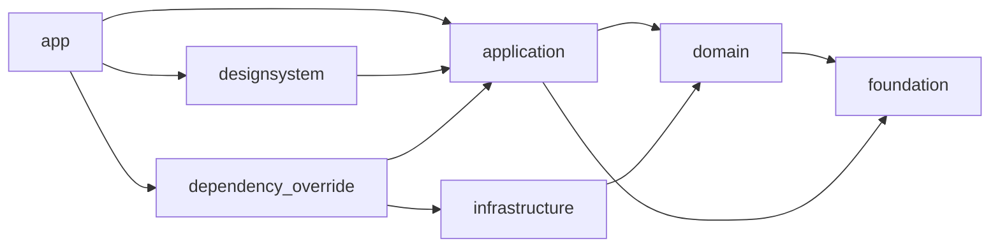

# アーキテクチャ

本テンプレートはオニオンアーキテクチャの依存性逆転に沿った4層構成です。

| パッケージ | 責務 |
|---|---|
| `packages/domain` | エンティティ、値オブジェクト、リポジトリ抽象、業務ルール |
| `packages/application` | ユースケース、アプリ状態、リポジトリを注入するProvider |
| `packages/infrastructure/*` | Firebase、SharedPreferences、Mockによるリポジトリ実装 |
| `packages/designsystem` | テーマ、共通Widget、画面非依存のUI表現 |
| `packages/dependency_override` | applicationのProviderとinfrastructure実装の結線 |
| `packages/foundation` | ドメイン非依存の汎用ユーティリティ |
| `apps/app` | 画面、ルーティング、ローカライズ、composition root |

domainはDartのみで構成し、Flutter、Riverpod、外部I/Oへ依存させません。
Riverpodはコード生成を使わず、application以外で必要なProviderも通常APIで定義します。
